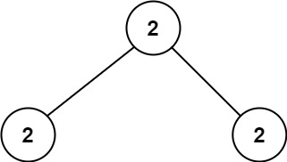

<!--
 * @Description: 
 * @Autor: Au3C2
 * @Date: 2021-07-27 15:01:29
 * @LastEditors: Au3C2
 * @LastEditTime: 2021-07-27 15:04:42
-->
# [671. 二叉树中第二小的节点](https://leetcode-cn.com/problems/second-minimum-node-in-a-binary-tree/)

给定一个非空特殊的二叉树，每个节点都是正数，并且每个节点的子节点数量只能为 `2` 或 `0`。如果一个节点有两个子节点的话，那么该节点的值等于两个子节点中较小的一个。

更正式地说，`root.val = min(root.left.val, root.right.val)` 总成立。

给出这样的一个二叉树，你需要输出所有节点中的 **第二小的值**。如果第二小的值不存在的话，输出 **-1** 。

 

**示例 1：**


```
输入：root = [2,2,5,null,null,5,7]
输出：5
解释：最小的值是 2 ，第二小的值是 5 。
```

**示例 2：**



```
输入：root = [2,2,2]
输出：-1
解释：最小的值是 2, 但是不存在第二小的值。
```

 

**提示：**

-   树中节点数目在范围 `[1, 25]` 内
-   `1 <= Node.val <= 231 - 1`
-   对于树中每个节点 `root.val == min(root.left.val, root.right.val)`

树 简单

# 代码

## 1. 遍历排序

```python
# Definition for a binary tree node.
# class TreeNode:
#     def __init__(self, val=0, left=None, right=None):
#         self.val = val
#         self.left = left
#         self.right = right
class Solution:
    def findSecondMinimumValue(self, root: TreeNode) -> int:
        nodeList = set()
        def dfs(root):
            if not root:
                return
            dfs(root.left)
            nodeList.add(root.val)
            dfs(root.right)
        dfs(root)
        nodeList = list(nodeList)
        nodeList.sort()
        if len(nodeList) < 2:
            return -1
        else:
            return nodeList[1]
```

## 2. 利用题目信息遍历二叉树

```python
# Definition for a binary tree node.
# class TreeNode:
#     def __init__(self, val=0, left=None, right=None):
#         self.val = val
#         self.left = left
#         self.right = right
class Solution:
    def findSecondMinimumValue(self, root: TreeNode) -> int:
        self.ans = -1
        def dfs(root, cur):
            if not root:
                return
            if root.val != cur:
                if self.ans == -1:
                    self.ans = root.val
                else:
                    self.ans = min(self.ans, root.val)
                    return
            dfs(root.left, cur)
            dfs(root.right, cur)
        dfs(root, root.val)
        return self.ans
```
