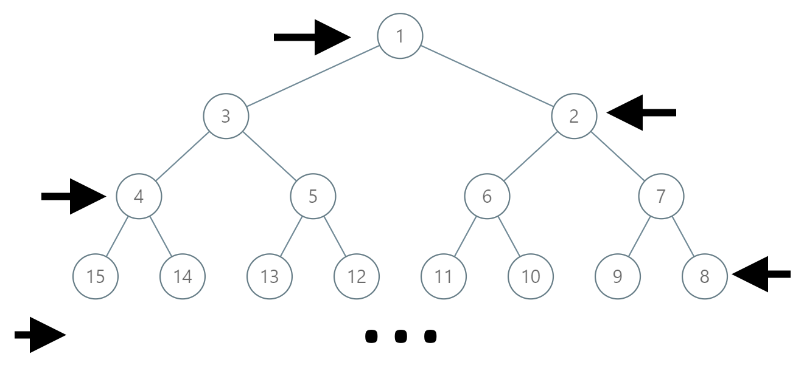

<!--
 * @Description: 
 * @Autor: Au3C2
 * @Date: 2021-07-29 12:45:46
 * @LastEditors: Au3C2
 * @LastEditTime: 2021-07-29 12:46:00
-->
# [1104. 二叉树寻路](https://leetcode-cn.com/problems/path-in-zigzag-labelled-binary-tree/)


在一棵无限的二叉树上，每个节点都有两个子节点，树中的节点 **逐行** 依次按 “之” 字形进行标记。

如下图所示，在奇数行（即，第一行、第三行、第五行……）中，按从左到右的顺序进行标记；

而偶数行（即，第二行、第四行、第六行……）中，按从右到左的顺序进行标记。



给你树上某一个节点的标号 `label`，请你返回从根节点到该标号为 `label` 节点的路径，该路径是由途经的节点标号所组成的。

 

**示例 1：**

```
输入：label = 14
输出：[1,3,4,14]
```

**示例 2：**

```
输入：label = 26
输出：[1,2,6,10,26]
```

 

**提示：**

-   `1 <= label <= 10^6`

树 中等

找规律即可

# 代码

```python
class Solution:
    def __init__(self):
        self.POWER2 = [1]
        for i in range(20):
            self.POWER2.append(self.POWER2[-1]*2)
    def pathInZigZagTree(self, label: int) -> List[int]:
        for n in range(21):
            if label < self.POWER2[n]:
                break
        n -= 1
        ans = [label]
        for i in range(n,0,-1):
            ans.append(self.POWER2[i]-1-ans[-1]//2+self.POWER2[i-1])
        return ans[::-1]
```

