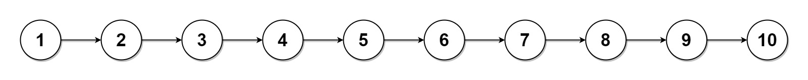

# [725. 分隔链表](https://leetcode-cn.com/problems/split-linked-list-in-parts/)

给你一个头结点为 `head` 的单链表和一个整数 `k` ，请你设计一个算法将链表分隔为 `k` 个连续的部分。

每部分的长度应该尽可能的相等：任意两部分的长度差距不能超过 1 。这可能会导致有些部分为 null 。

这 `k` 个部分应该按照在链表中出现的顺序排列，并且排在前面的部分的长度应该大于或等于排在后面的长度。

返回一个由上述 `k` 部分组成的数组。

**示例 1：**


```
输入：head = [1,2,3], k = 5
输出：[[1],[2],[3],[],[]]
解释：
第一个元素 output[0] 为 output[0].val = 1 ，output[0].next = null 。
最后一个元素 output[4] 为 null ，但它作为 ListNode 的字符串表示是 [] 。
```

**示例 2：**



```
输入：head = [1,2,3,4,5,6,7,8,9,10], k = 3
输出：[[1,2,3,4],[5,6,7],[8,9,10]]
解释：
输入被分成了几个连续的部分，并且每部分的长度相差不超过 1 。前面部分的长度大于等于后面部分的长度。
```

 

**提示：**

-   链表中节点的数目在范围 `[0, 1000]`
-   `0 <= Node.val <= 1000`
-   `1 <= k <= 50`

链表 中等

# 代码

自己写的有点丑

```python
# Definition for singly-linked list.
# class ListNode:
#     def __init__(self, val=0, next=None):
#         self.val = val
#         self.next = next
class Solution:
    def splitListToParts(self, head: ListNode, k: int) -> List[ListNode]:
        n = 0
        p = head
        while p:
            n += 1
            p = p.next
        ans, cur = [], head
        if n <= k:
            while cur:
                ans.append(cur)
                cur.next, cur = None, cur.next
            while k - n > 0:
                ans.append(None)
                n += 1
        else:
            i, m, pre, j = 0, n//k, None, n%k
            while i<(m+1)*j:
                if i%(m+1) == 0:
                    ans.append(cur)
                    if pre: 
                        pre.next = None
                pre, cur = cur, cur.next
                i += 1
            while i < n:
                if (i-(m+1)*j)%m == 0:
                    ans.append(cur)
                    if pre: 
                        pre.next = None
                pre, cur = cur, cur.next
                i += 1
        return ans
            

```

别人写的比较好看

```python
class Solution:
    def splitListToParts(self, head: ListNode, k: int) -> List[ListNode]:
        
        n = 0
        tmp = head
        while tmp:
            tmp = tmp.next
            n += 1
        size = n//k
        remain = n%k
        # i遍历链表，当i小于remain时，统统在size的基础上加1
        res = [None]*k
        cur = head
        i = 0
        while i < k and cur:
            res[i] = cur
            plus = 1 if i < remain else 0
            my_len = size + plus
            for j in range(my_len-1):
                cur = cur.next
            tmp = cur.next
            cur.next = None
            cur = tmp
            i += 1
        
        return res
```

